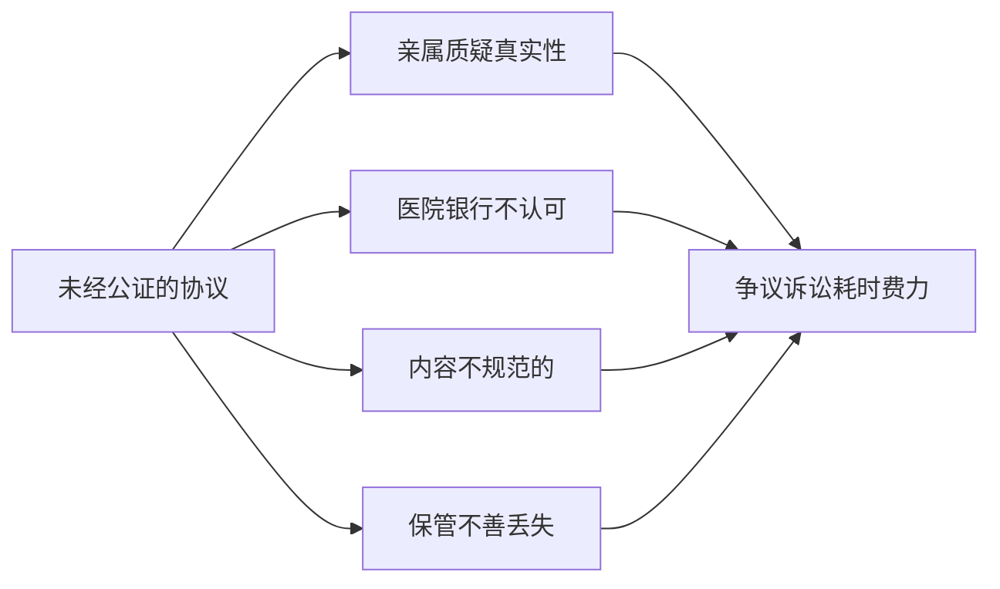

# 意定监护·公证指南

> 全国公证机构操作指引汇编

---

## 一、为什么选择公证

**意定监护协议的核心风险：**



**公证的核心优势：**
- 证明力强 —— 《民事诉讼法》规定公证证据效力优先
- 审查专业 —— 公证员把关协议合法性与可执行性
- 永久保管 —— 公证档案长期保存
- 备案可查 —— 全国公证平台可查询

---

## 二、公证处的选择

### 2.1 哪些公证处可以办理

| 类型 | 说明 |
|------|------|
| 任意公证处 | 全国公证处均可（不限户籍或住所地） |
| 推荐首选 | 有成熟意定监护业务经验的公证处 |

### 2.2 重点城市经验丰富的公证处

| 城市 | 公证处 | 特色 |
|------|--------|------|
| 上海 | 上海市普陀公证处 | 全国最早开展意定监护公证 |
| 上海 | 上海市东方公证处 | 业务量大、经验丰富 |
| 北京 | 北京市长安公证处 | 有专门的意定监护团队 |
| 北京 | 北京市方正公证处 | 意定监护+遗嘱+信托综合服务 |
| 广州 | 广州市南方公证处 | 综合养老法律服务 |
| 深圳 | 深圳市公证处 | 创新意定监护服务模式 |
| 杭州 | 杭州市国立公证处 | 综合性家事法律服务 |
| 南京 | 南京公证处 | 意定监护业务全国领先 |

---

## 三、公证前准备

### 3.1 需要携带的材料

**委托人（设立人）准备：**

```
□ 身份证原件 + 复印件
□ 户口本原件 + 复印件
□ 婚姻状况证明（如有）
□ 财产证明（房产证、银行存单等，如涉及财产管理）
□ 意定监护协议草稿（如有）
□ 相关医疗证明（如有）
□ 近亲属情况说明（如有特殊家庭情况）
□ 其他：________________________________
```

**监护人准备：**

```
□ 身份证原件 + 复印件
□ 户口本原件 + 复印件
□ 个人信用报告（建议准备，非强制）
□ 无犯罪记录证明（建议准备，非强制）
□ 健康状况说明（如有）
□ 其他：________________________________
```

### 3.2 提前准备事项

- [ ] 双方对监护范围达成共识
- [ ] 了解意定监护的法律效果
- [ ] 确认委托人的精神状态（如有需要可提前做检查）
- [ ] 准备好公证费用（参考：500-2000 元）
- [ ] 提前致电公证处预约（说明意定监护公证需求）

---

## 四、公证过程详解

### 4.1 第一步：预约与咨询

```
致电公证处 → 说明办理"意定监护协议公证"
            → 确认材料清单
            → 预约办理时间
            → 确认公证费用
```

### 4.2 第二步：到场办理

**流程时间：** 约 1 - 2 小时

**人员要求：**
- 委托人必须亲自到场 ❗
- 监护人必须亲自到场 ❗
- 监督人（如有）建议同时到场

**办理过程：**

```
┌─────────────────────────────────────────┐
│          公证受理                         │
│  ├─ 填写公证申请表                       │
│  ├─ 提交身份证明及材料                   │
│  └─ 公证员初步审查                       │
├─────────────────────────────────────────┤
│          单独询问（关键环节）              │
│  ├─ 对委托人单独谈话                     │
│  │   ├─ 确认真实意愿                     │
│  │   ├─ 确认精神状态                     │
│  │   ├─ 确认无受胁迫、欺诈               │
│  │   ├─ 了解家庭关系与财产状况           │
│  │   └─ 确认理解法律后果                 │
│  └─ 对监护人单独谈话                     │
│      ├─ 确认自愿承担监护职责             │
│      ├─ 确认理解职责范围                 │
│      └─ 确认具备履职条件                 │
├─────────────────────────────────────────┤
│          协议审查与修改                   │
│  ├─ 公证员审核协议条款                   │
│  ├─ 提出修改建议（如有）                 │
│  └─ 双方确认最终版本                     │
├─────────────────────────────────────────┤
│          签署文件                        │
│  ├─ 签署意定监护协议                    │
│  ├─ 签署公证申请表                      │
│  ├─ 签署谈话笔录                        │
│  └─ 签署送达地址确认书                  │
├─────────────────────────────────────────┤
│          缴费与出证                       │
│  ├─ 缴纳公证费                          │
│  ├─ 领取受理回执                        │
│  └─ 等待取公证书（3-15个工作日）         │
└─────────────────────────────────────────┘
```

### 4.3 第三步：领取公证书

- 双方携身份证领取
- 检查公证书内容是否正确
- 公证处留存正本，双方各持副本/复印件
- 可申请公证处提供电子版备份（公证云平台）

---

## 五、公证费的计收标准

| 项目 | 参考价格 | 备注 |
|------|---------|------|
| 意定监护协议公证 | 500 - 2,000 元 | 各地标准不同 |
| 公证文书副本 | 20 - 50 元/份 | 多要几份备用 |
| 加急费 | 200 - 500 元 | 非必要 |
| 上门服务费 | 1,000 - 3,000 元 | 行动不便者适用 |

> 💡 上海、北京等地对 70 岁以上老年人有公证费减免政策，建议提前咨询。

---

## 六、公证后的注意事项

### 6.1 公证书保管

- 委托人：原件安全保管（保险箱/银行保管箱）
- 监护人：持副本
- 建议告知 1-2 位可靠亲属公证书存放位置
- 可在公证处申请存档服务

### 6.2 协议变更

**完全行为能力期间：**
- 委托人可随时单方撤销协议（书面通知公证处及监护人）
- 双方可协商变更协议内容（重新公证）
- 委托人可指定新的监护人（重新公证）

**丧失行为能力后：**
- 不可撤销协议
- 监护人违反监护职责的，由监督人或利害关系人申请撤销监护人资格

### 6.3 信息更新

出现以下情形建议更新意定监护协议：
- 委托人或监护人住所地变更
- 委托人或监护人婚姻状况变化
- 委托人财产状况重大变化
- 监护人健康状况变化无法履职
- 法律法规变化影响协议执行

---

## 七、常见公证 Q&A

**Q: 公证员问得太细了，有必要吗？**
A: 有必要。公证员的细致询问是为了确认您真实意愿，避免未来被质疑协议效力。

**Q: 公证处会泄露我的隐私吗？**
A: 公证员依法负有保密义务，未经您同意不得向第三方透露协议内容。

**Q: 我可以只让公证处保管协议，不告诉任何人吗？**
A: 可以，但建议至少告知一位可靠人士保管方式，否则丧失行为能力后可能无人启动协议。

**Q: 公证后还需要做行为能力鉴定吗？**
A: 公证本身不鉴定行为能力。生效时需要另行提供医院诊断或司法鉴定证明。

**Q: 人在国外，能办意定监护公证吗？**
A: 可在当地中国使领馆办理公证，或委托国内亲属办理（需经使领馆认证的授权委托书）。

---

## 八、各地公证处联系信息查询

建议通过以下渠道查询当地可办理意定监护公证的公证处：

1. **中国公证协会官网**：www.chinanotary.org
2. **司法部公证服务查询平台**
3. **各地司法局公证管理科**
4. **拨打 12348 法律服务热线**咨询

---

> 📅 最后更新：2026 年 6 月
>
> ⚠️ 各地公证处的具体要求和收费标准可能不同，建议预约时详细咨询。
